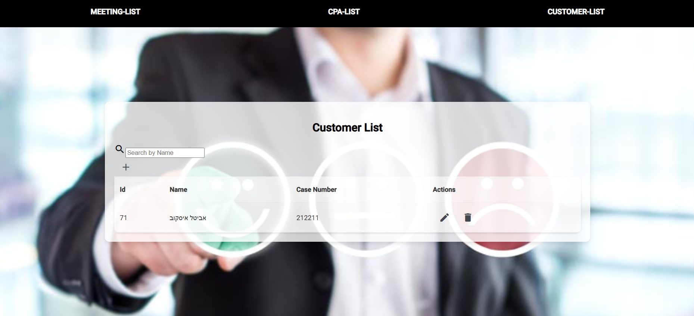

# מערכת לניהול לקוחות ועורכי דין

מערכת זו נועדה לשפר את ניהול הלקוחות, עורכי הדין והפגישות, ומספקת ממשק אינטואיטיבי לצפייה, הוספה, עריכה ומחיקה של רשומות.

## טכנולוגיות בשימוש
- **Frontend**: Angular (גרסה: [18])
- **Backend**: C# (.NET Core) במבנה של שכבות (API, Core, Data, Service)
## צילומי מסך:

myProject/src/assets/צילום מסך 2024-11-02 201408.png

